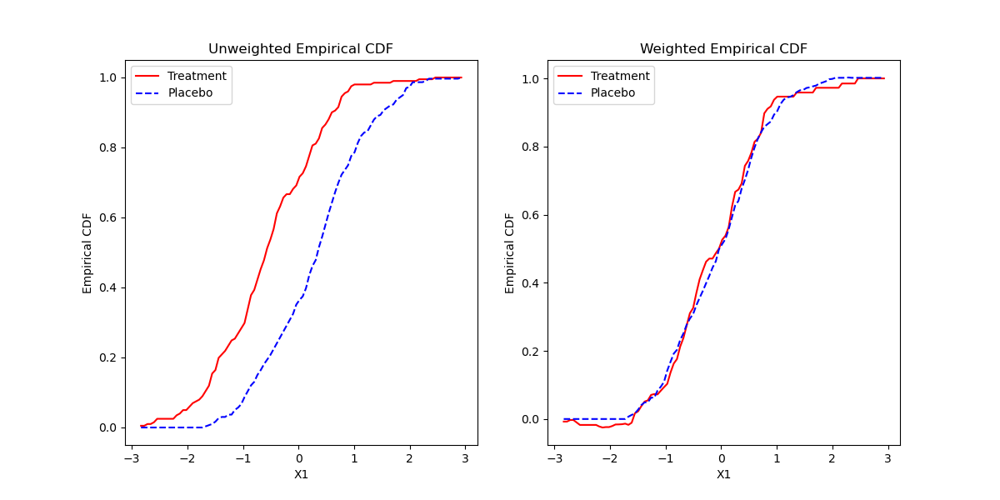
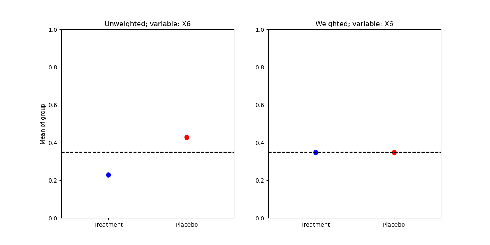

# Python package: ATE

The main aim of `ATE` is to provide a user-friendly interface for nonparametric efficient inference of average 
treatment effects for observational data. The package provides point estimates for average treatment 
effects, average treatment effect on the treated and can also handle the case of multiple treatments.
The package also allows inference by consistent variance estimates.

#### Requirements
- `numpy`
- `pandas`
- `scipy`
- `matplotlib`

## Installation

The package can be installed from pypi:
```
pip install ATE-python
```

Alternatively, we can directly install from Github:
```
pip install git+https://github.com/ross1456/ATE-python.git
```


## Key Features
* Ease of use: The main function `ATE` requires only a numeric matrix `X` of covariates, numeric vector `Y` of response 
and `treat` vector indicating treatment assignment.
```python

#Generate some data
import numpy as np
np.random.seed(0)
n = 500
# Generate covariates
X1 = np.random.normal(size=(n, 5))
X2 = np.random.binomial(1, 0.4, size=(n, 3))
X = np.hstack((X1, X2))

# Calculate propensity scores
prop = 1 / (1 + np.exp(X[:, 0] - 0.5 * X[:, 1] + 0.25 * X[:, 2] + X[:, 5] + 0.5 * X[:, 7]))

# Treatment assignment
treat = np.random.binomial(1, prop, size=n)

# Outcome variable
Y = 10 * treat + (2 * treat - 1) * (X[:, 0] - 0.5 * X[:, 1] + 0.25 * X[:, 2] + X[:, 5] + 0.5 * X[:, 7]) + np.random.normal(size=n)


#Fit ATE object
ate1 = ATE()
ate1.fit(Y, treat, X)
ate1.summary()

          Estimate  Std. Error  95%.Lower  95%.Upper    z value       p value
E[Y(1)]  10.522690    0.106475  10.314003  10.731376  98.827916  0.000000e+00
E[Y(0)]  -0.640634    0.080557  -0.798523  -0.482746  -7.952586  1.826574e-15
ATE      11.163324    0.157352  10.854920  11.471728  70.944896  0.000000e+00
```
* `plot` function for demonstrating effect of covariate balancing for continuous and binary 
covariates.
```python
ate1.plot()
```




* We can also estimate the average treatment effect on the treated. 
```python
ate2 <- ATE(ATT = TRUE)
ate2.fit(Y, treat,X)
ate2.summary()

         Estimate  Std. Error  95%.Lower  95%.Upper    z value   p value
E[Y(1)]  9.702759    0.100730   9.505331   9.900187  96.324138  0.000000
E[Y(0)]  0.265824    0.121707   0.027283   0.504365   2.184136  0.028952
ATE      9.436935    0.188530   9.067422   9.806448  50.055253  0.000000
```

* `ATE` automatically detects and estimates the case of multiple treatment arm. 
```python

ate3<-ATE()
ate3.fit(Y,treat,X)
ate3.summary()

          Estimate  Std. Error  95%.Lower  95%.Upper   z value       p value
E[Y(0)]  -0.433280    0.332050  -1.084086   0.217526 -1.304863  1.919395e-01
E[Y(1)]  10.391241    1.421770   7.604622  13.177860  7.308663  2.698139e-13
E[Y(2)]  21.393437    5.246493  11.110499  31.676375  4.077664  4.549043e-05
E[Y(3)]  32.643964   12.081066   8.965510  56.322417  2.702077  6.890790e-03
```
